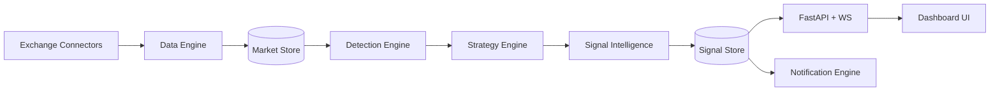

# Crypto Intelligence Screener (MVP)

Профессиональный SaaS-прототип крипто-скринера с объясняющими сигналами, вероятностной оценкой и историческими совпадениями.

## Что реализовано

- **Data Engine**
  - Мульти-биржевой слой (Binance, OKX, Bybit, MEXC, Gate, Bitget) через коннекторы.
  - Единый формат данных `MarketTick`.
  - Подготовка к websocket-first и REST fallback (в MVP используются mock-коннекторы).
- **Signal Detection Engine**
  - Детекторы: Pump/Dump, Order Book Density proxy, Listing heuristic, Pattern breakout.
- **Signal Intelligence Engine**
  - Объяснение сигналов: причины, тип поведения рынка, confidence score 0–100%, исторические аналогии.
- **Strategy Engine**
  - Модульная стратегия `Strategy` + registry для добавления новых стратегий.
- **Notification System**
  - Telegram-ready notifier с антиспам кулдауном.
- **Frontend UI/UX**
  - Реал-тайм поток сигналов через WebSocket.
  - Дашборд с drag&drop карточками.
  - Панель объяснения сигнала, тепловая карта, streaming chart proxy.

## Архитектура



## Быстрый запуск

```bash
python -m venv .venv
source .venv/bin/activate
pip install -r requirements.txt
uvicorn web.main:app --reload
```

Открыть: `http://localhost:8000`

## Основные API

- `GET /api/markets` — snapshot рынков.
- `GET /api/signals` — последние сигналы.
- `POST /api/simulate/tick` — тестовый тик.
- `WS /ws/stream` — real-time поток тиков и сигналов.

## Что добавить следующим этапом

1. Подключение реальных биржевых WebSocket API + REST fallback пер exchange.
2. TimescaleDB + Redis/Kafka для масштабирования real-time конвейера.
3. Реальный order book ingestion и big-player footprint модели.
4. Backtest/forward-test scoring и accuracy ranking по стратегиям.
5. Полноценная Telegram интеграция (бот, шаблоны, фильтры, юзер-профили).
